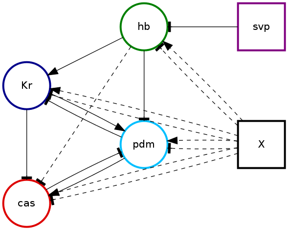
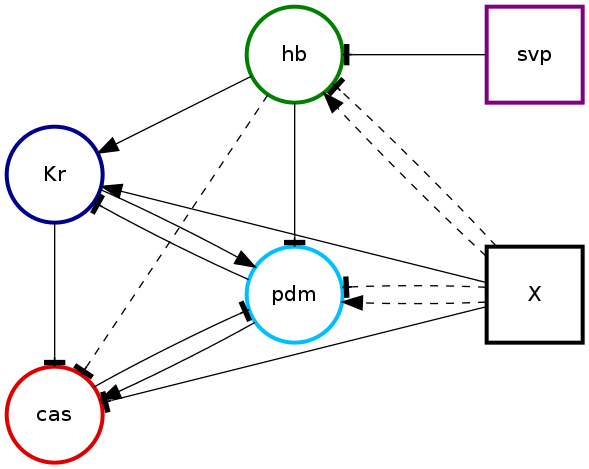
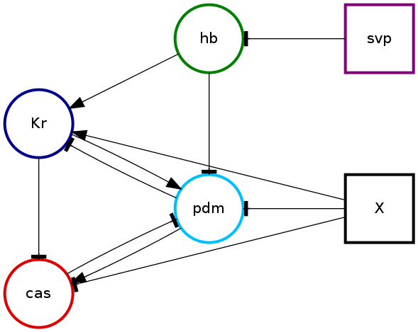
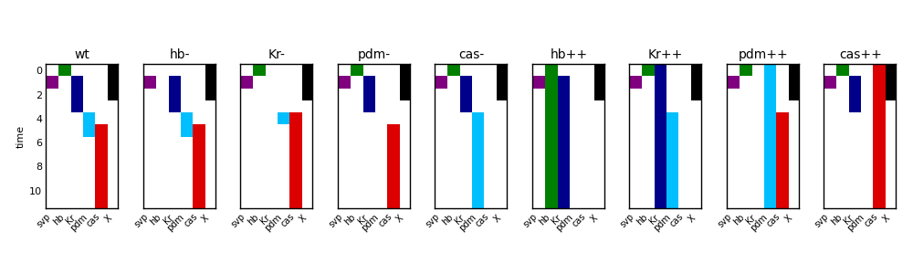

..
.. Copyright John Reid 2013
..
.. This is a reStructuredText document. If you are reading this in text format, it can be 
.. converted into a more readable format by using Docutils_ tools such as rst2html.
..

.. _Docutils: http://docutils.sourceforge.net/docs/user/tools.html

Running pybool
==============

.. _running:

We illustrate how pybool works using an example from a paper_ by Nakajima et al. 
The code that configures pybool to run this example is included in the pybool
distribution. Later on we will show how to write your own code to :doc:`configure<configure>` pybool
to run on your biological system of interest but for the time being let's start with a
system that has already been configured.

.. _paper: http://www.ploscompbiol.org/article/info%3Adoi%2F10.1371%2Fjournal.pcbi.1000760

Nakajima et al. are interested in the regulatory network that controls neurogenesis
in *Drosophila*. The system consists of six genes, hb, Kr, pdm, cas, svp and X.
They have loss-of-function and over-expression time-course data for hb, Kr, pdm
and cas. svp and X are regarded as external inputs to the system. In total this makes
nine conditions: a wild-type condition and loss-of-function conditions and over-expression
conditions for each of hb, Kr, pdm and cas. For each of the nine conditions Nakajima et al.
have a set of expression constraints detailing the order in which genes are expressed. All of
this information is encoded in a python module that is used to configure pybool: `pybool.examples.tutorial`.

To run this example execute the following command::

    pybool-find-consistent --plot 5 pybool.examples.tutorial

This will generate some output to the screen and also create a directory
called ``pyboolOutput`` which will contain several images and a log file.

Input: Restrictions
~~~~~~~~~~~~~~~~~~~

In pybool expert knowledge is encoded as restrictions on the permitted regulatory relationships.
These restrictions are part of the configuration used as input to pybool. pybool will create
graphical representations of which regulatory relationships are permitted in a file called
``net-restrictions.png``.

The first thing to notice is that every gene is configured to be represented by a specific color.
This will be consistent across all of pybool's output. Secondly, external inputs are represented
as square nodes in the graph. Genes that can be regulated are represented as circles. The possible
activatory or repressive regulatory relationships are shown as directed edges in the graph. Activatory
relationships are represented by an arrowed edge, Repressive relationships are represented by edges
that end in a bar. If the absence of regulation is allowed then the edges are dashed rather than solid.

We can see the expert knowledge encoded in the configuration. For example:

 - hb represses pdm
 - svp represses hb
 - pdm activates cas
 - cas represses pdm
 - hb can repress cas or have no effect
 - X can repress or activate or have no effect on pdm

Output: Consistent networks
~~~~~~~~~~~~~~~~~~~~~~~~~~~

There will also be a representation of the consistent networks that pybool found in the file ``net-consistent.png``.

This image will show which edges were present in the set of consistent networks. The consistent
networks are those which produce expression patterns (a.k.a. realisations) that are consistent with the temporal
expression constraints specified in the input configuration.

Output: Example realisations
~~~~~~~~~~~~~~~~~~~~~~~~~~~~

As we used the ``--plot 5`` argument to ``pybool-find-consistent`` there will also be images representing
five of the consistent networks and their realisations. Here is the second of these networks

and its realisation

The realisation of each condition is represented separately. The genes are colour coded as in the network
diagrams and the y-axis represents time from top to bottom.

Output: text
~~~~~~~~~~~~

pybool also outputs information to the screen and a log file ``pybool-find-consistent.log``.
Here you can find extra information such as how many networks were tested for consistency, how many
were consistent, which parameters for external inputs were in consistent networks, which constitutive
expression levels were in consistent networks.

.. include:: _static/pybool-find-consistent.log
    :literal:
    

Parallelism
~~~~~~~~~~~

Finding consistent networks is easily parallelisable and pybool takes advantage of this using the
IPython parallel framework. Full instructions for setting up this framework can be found on the IPython
website_ but we describe a simple set up here. Make sure IPython is installed and start a cluster
of four local engines::

    ipcluster start -n 4

Now simply run ``pybool-find-consistent`` with the ``-p`` command line option::

    pybool-find-consistent -p --plot 5 pybool.examples.tutorial
    
Here we have just used four engines on our local machine but IPython makes it easy to distribute the
work across many engines on many machines. See their website_ for how to set this up.

.. _website: http://ipython.org/ipython-doc/dev/parallel/

    